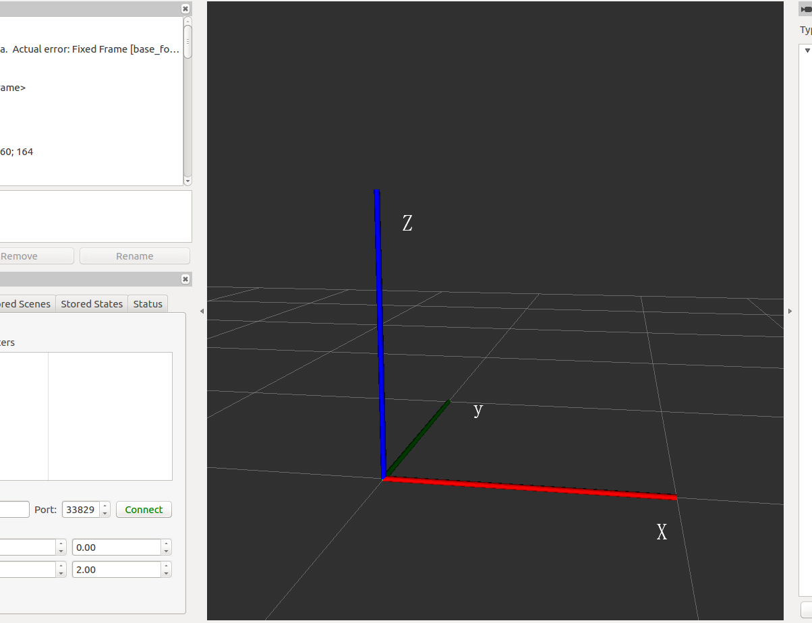
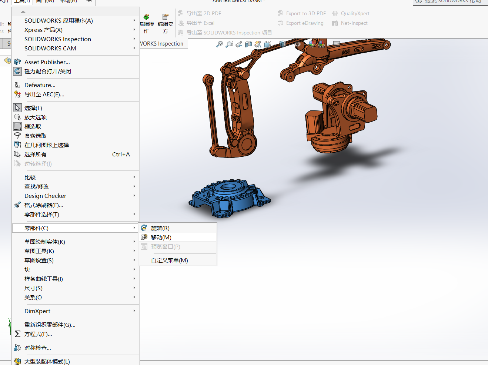
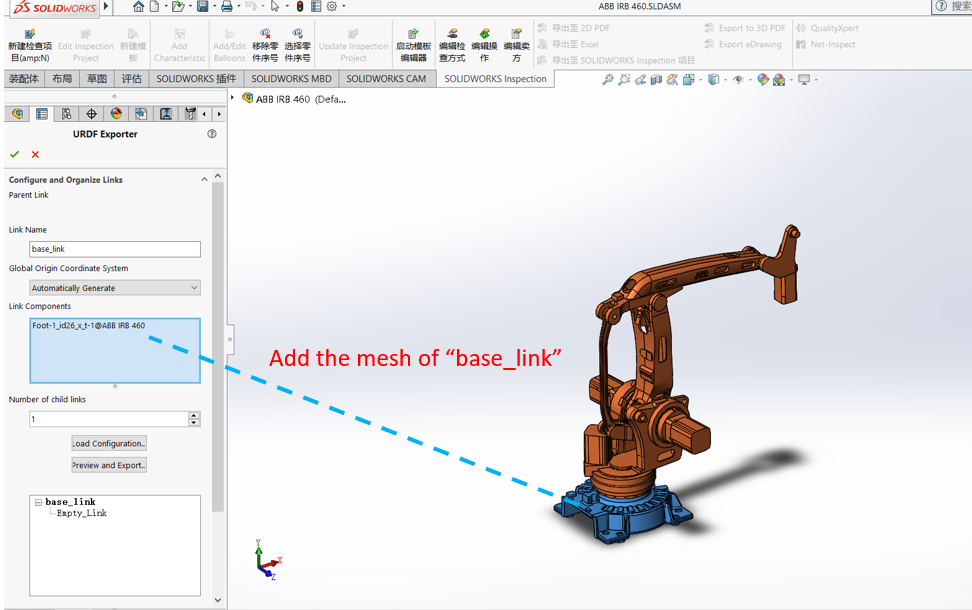
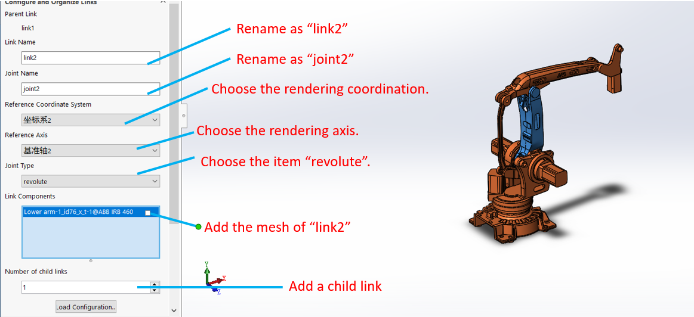
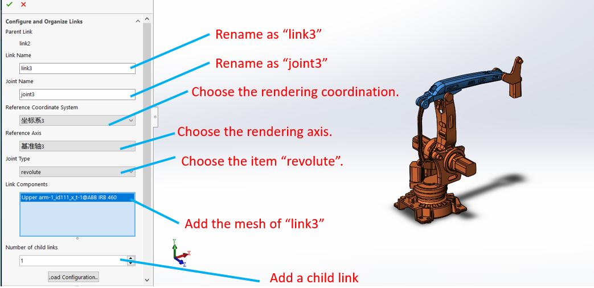
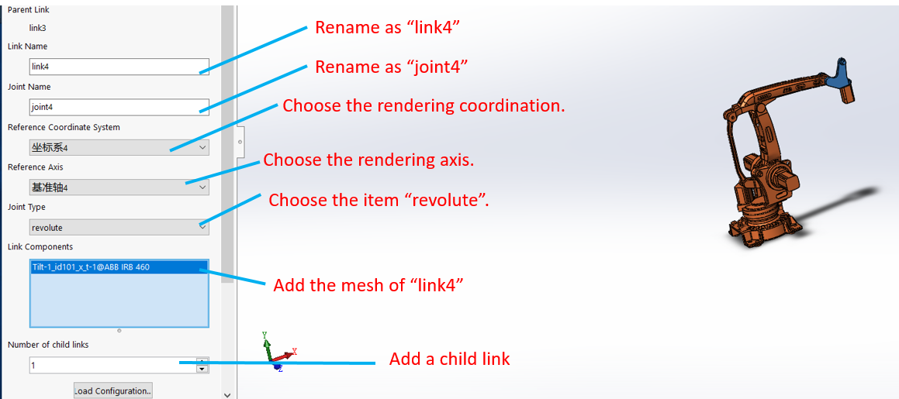
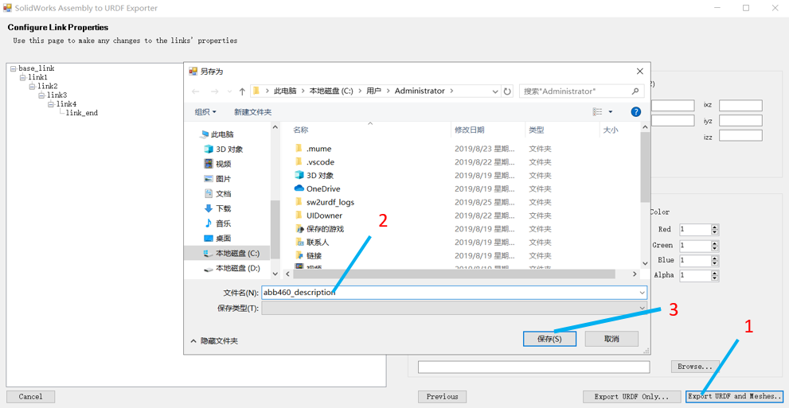

#Solidwork 模型制止 urdf

本次实验制作一个机器人的URDF包，本次使用机器人的是ABB，型号是460，是一种四自由度的机器人。
下载好的模型如下：

#
#
sldprt是solidworks中的零件。我们新建一个装配体，然后把零零散散的零件放入装配体中进行装配。但是需要注意的是，装配之前我们一定确定坐标系

#
#
SolidWorks中的坐标系使用的符合左手系，坐标轴Y是朝上的。

#
#
而对应的RVIZ中使用的坐标系是右手系，坐标轴Z是朝上的。

#
#
sw和rviz的坐标系是对应的，sw的Y轴等同于rviz的z轴，因此在重新装配零件的时候一定要注意。选中机器人的底盘，$\color{red}{移动到世界坐标系的原点}$，然后才开始装配。

#
#
装配好模型之后，开始导出urdf包

#
#
首先安装插件pic/sw2urdfSetup。这个可以到维基下载安装完成后重启solidwork即可

#
#
然后加入参考坐标系以及旋转轴（坐标系与旋转轴和DH模型类似）：

建立好的坐标系以及旋转轴大致如下

#
#
现在开始导出：

#
#
导出设置：

#
#
模型预览
把导出的包在工作空间中编译：
roslaunch [your_package] display.lauch
rviz启动后修改一下fixedframe选项
再点add按钮添加robotmodel就能显示我们的机器人
