#Create a URDF pack based on SW

In this experiment, a URDF package is made. The robot used in this experiment is ABB-460 , a Four-Joints manipulator.
The download model：
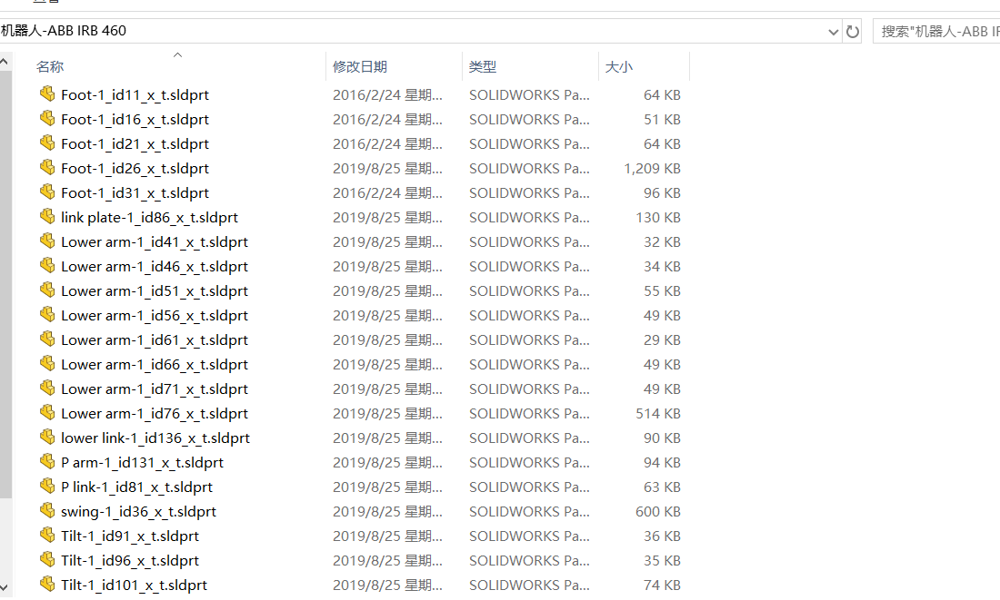

#
#
Sldprt is a part of solidworks. We build a new assembly and then put scattered parts into the assembly to reassemble. But it's important to note that we must determine the coordinate system before reassembling.
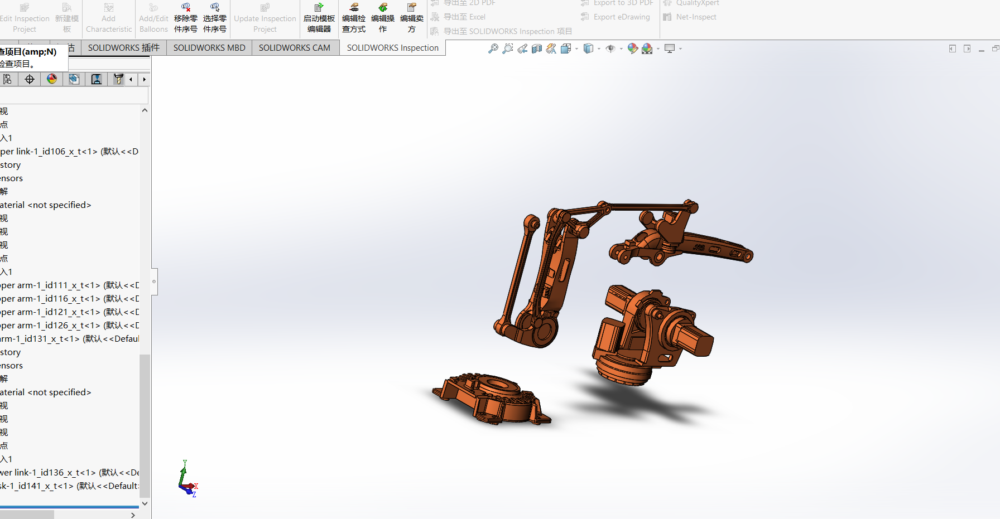
#
#
The coordinate system in SolidWorks is left-handed, and the axis Y is upward.
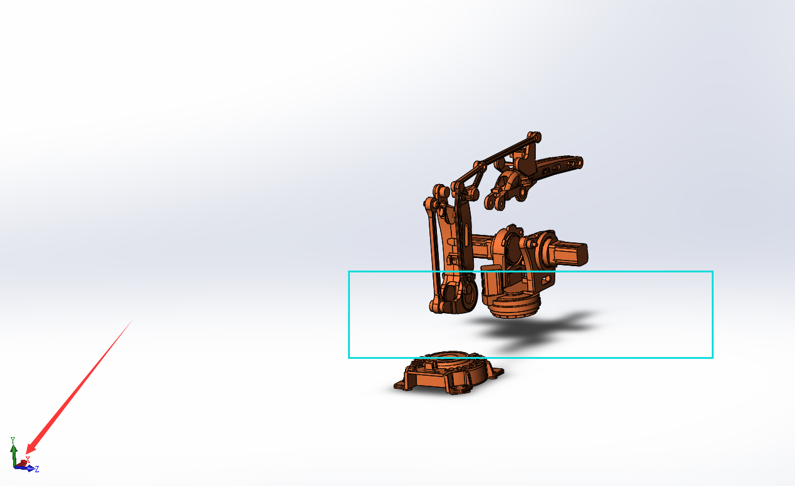
#
#
However,the rendering coordinate system in Rviz is right-handed, and the axis Z is upward. 
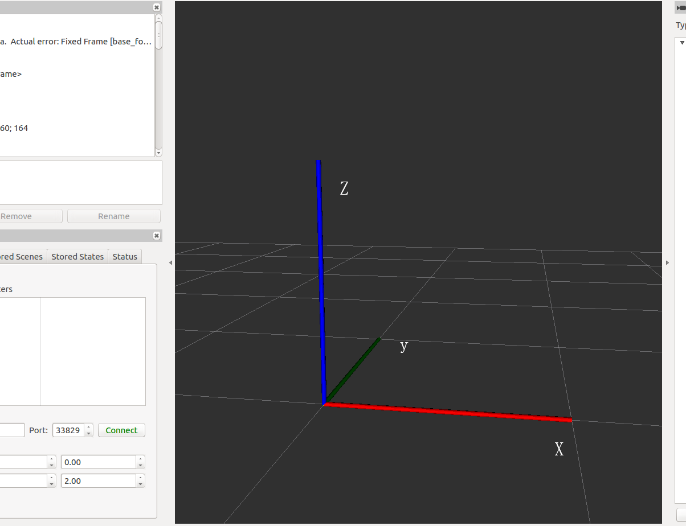
#
#
The coordinate system of SW and rviz corresponds. The Y axis of SW is equal to the Z axis of rviz, so we must pay attention to it while reassembling. Select the base of the robot, move it to the origin of the world coordinate system before reassembling.
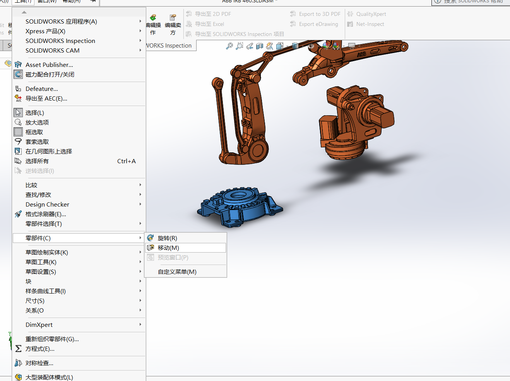
#
#
export URDF package:
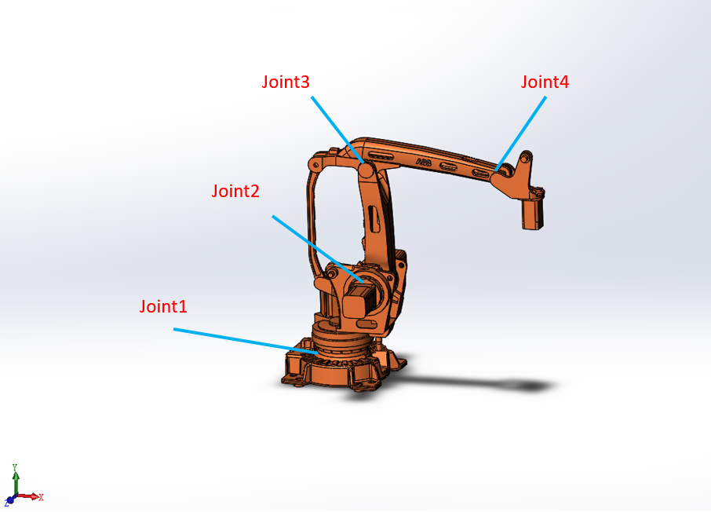
#
#
install the plugin - sw2urdfSetup(download from wiki)
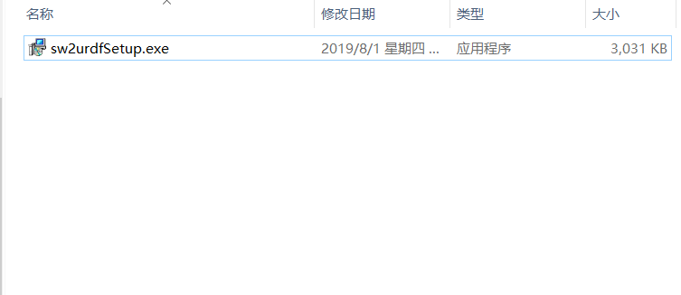
#
#
Then create the reference coordinate system and the rotating axis：
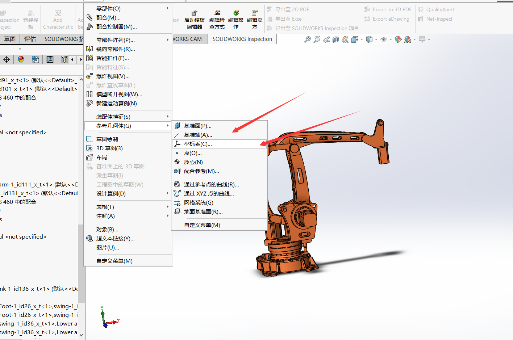
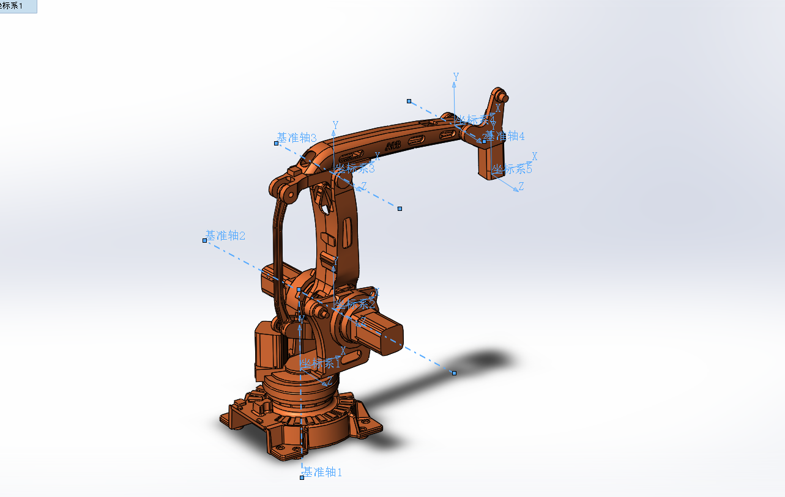
#
#
export：
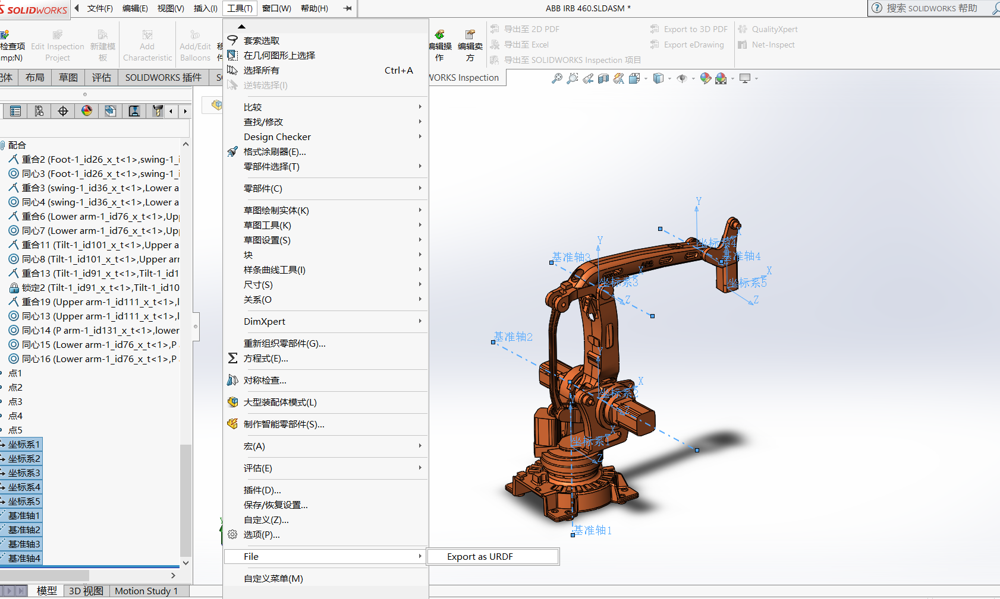
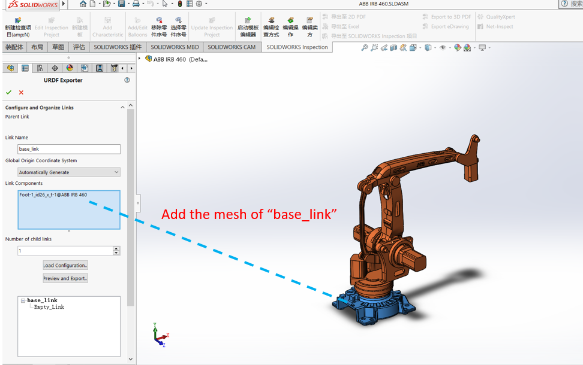
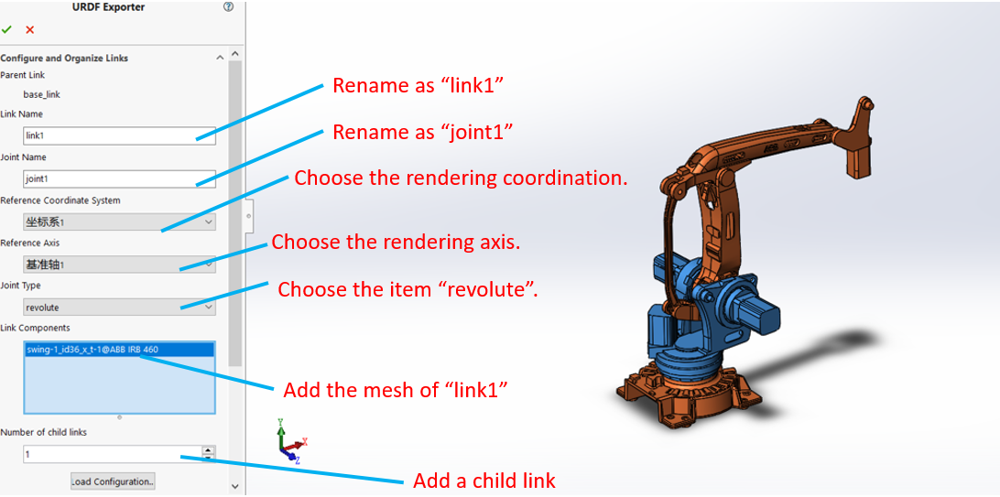
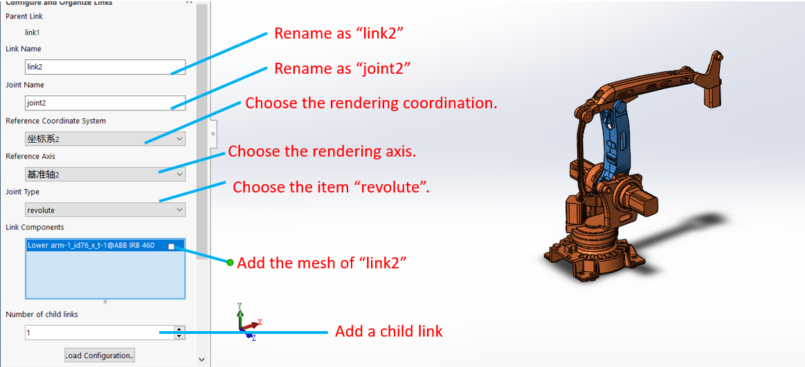

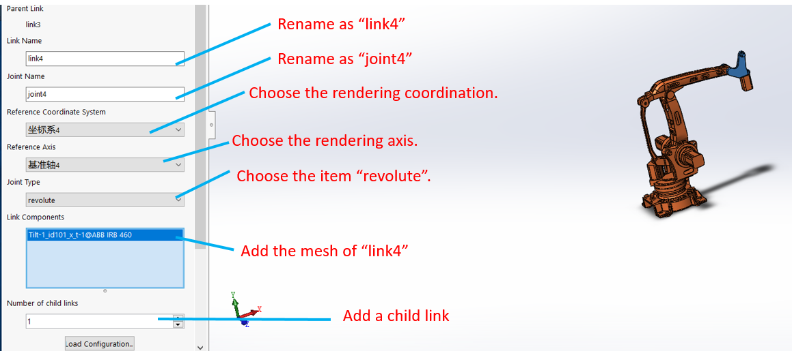
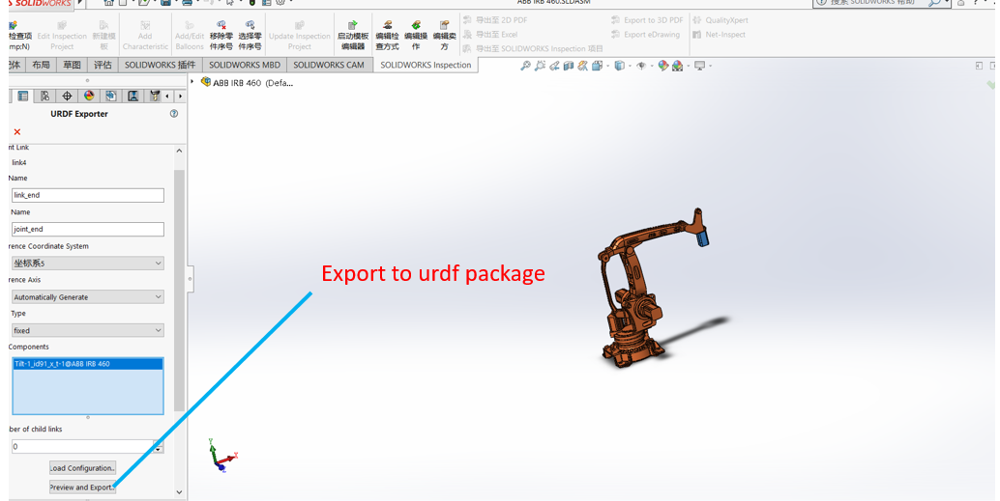
#
#
change the parameter：
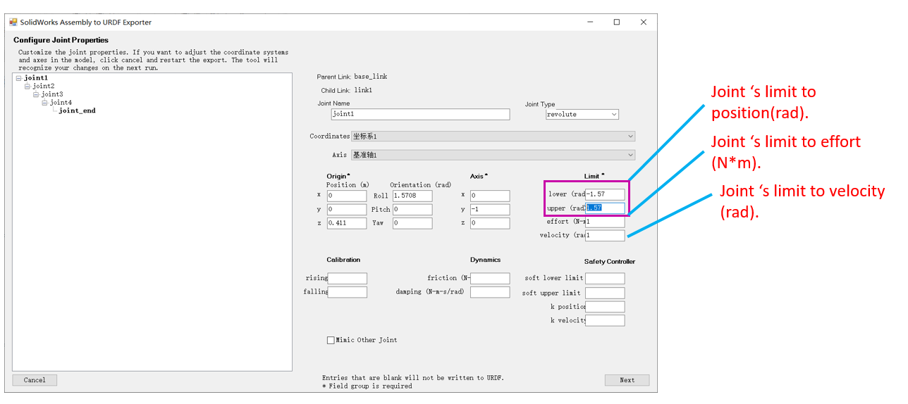
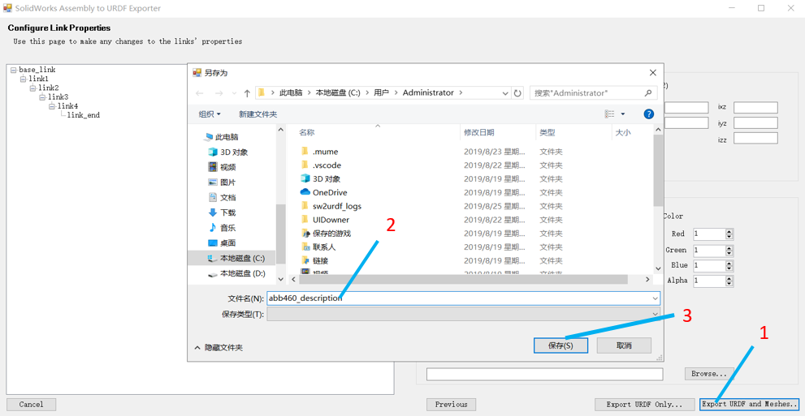
#
#
view the robot
catkin_make in you workspace：
roslaunch [your_package] display.lauch
change the item "fixedframe"
click the button "add" add a robot model:
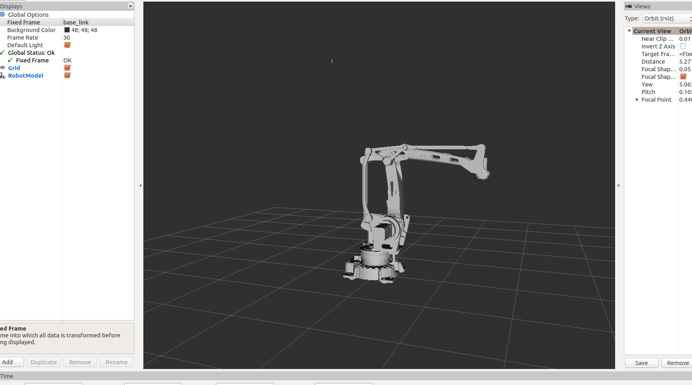